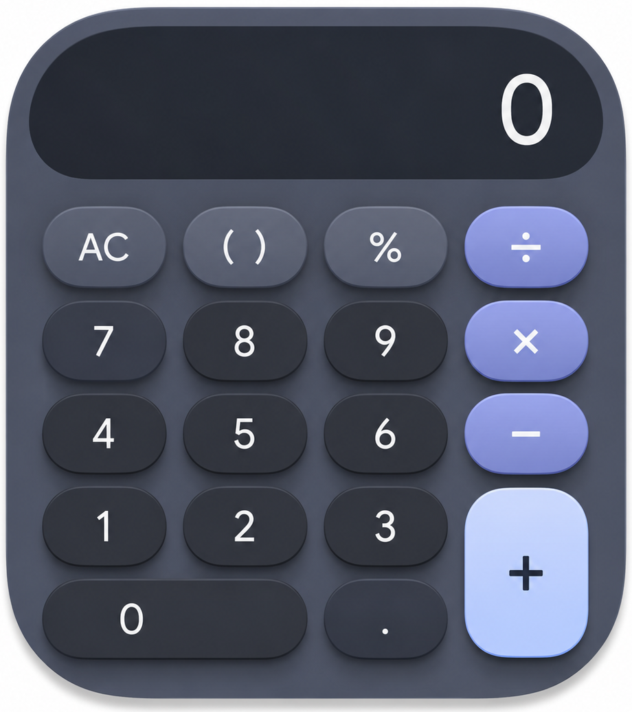
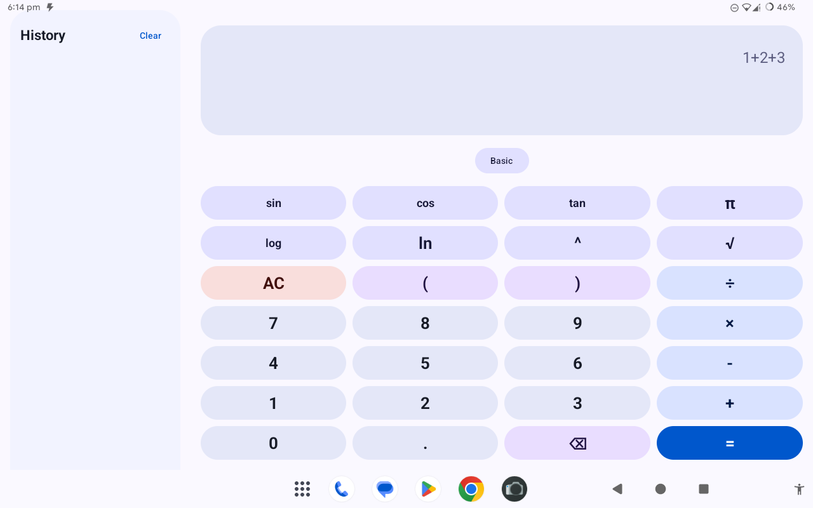
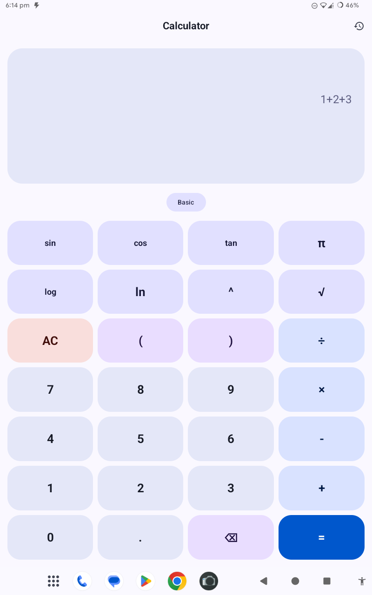
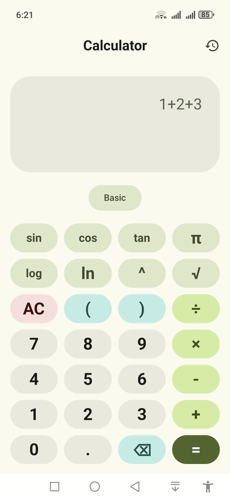
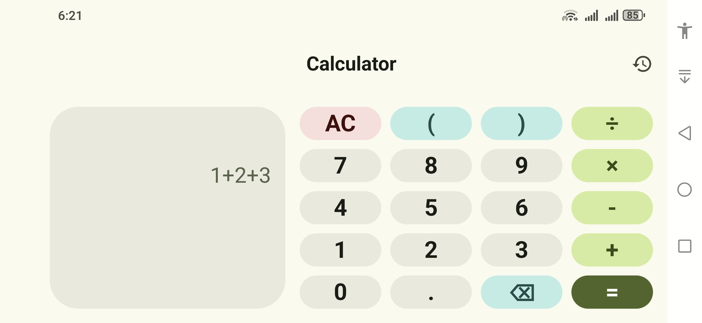

# Ambient Calculator
An open source dynamic and beautiful calculator for Android phone and tablet. 

## 📖 Features

* None permissions required
* Dark, Light, Material You and Google Material 3 theme
* Scientific mode
* History
* Optimised for phone (single panel) and tablet (dual panel)
* Quick settings tile
* Fast Speed

## ⚠️ Requirements

* Android 10.0+

## 📷 Screenshots

## ☕ Support

Support Ambient Calculator development by subscribing, watching, liking and sharing my YT channel. Thank you very much for your help! ❤️

<a href="https://www.youtube.com/@techambient">
  Click Here To View my YouTube Channel
</a>

## 💬 Ambient FastMessenger

Join my Ambient FastMessenger! 

## 🔨 Contributing

Pull requests are strongly recommended. For major changes, please open an issue first to discuss what you would like to change.

## 🌎 Translations

You can help translate Ambient Calculator by using this repo codes. 

## 📜 License

This project is licensed under [MIT License](/LICENSE)

## ❔ Frequently Asked Questions

No data available. 
