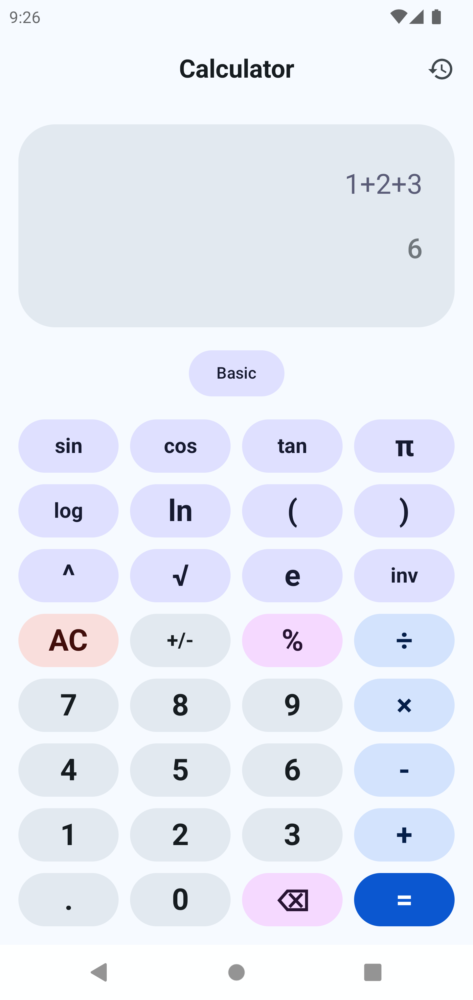
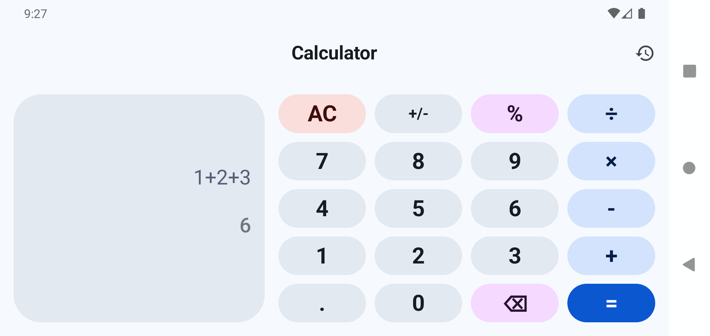
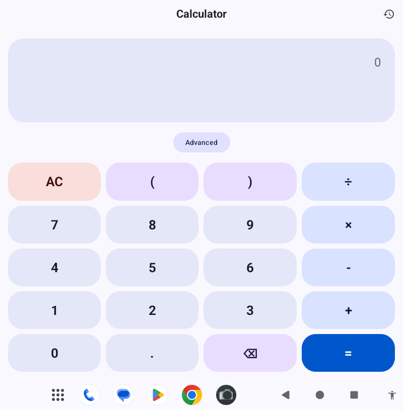

# Ambient Calculator
Best open source AI-powered, modern, dynamic and beautiful calculator for Android tablet, phone and foldables. 

## 📖 Features

* None permissions required
* Offline AI powered math to result OCR
* Offline Handwriting-to-math (Preview)
* Lightweight, only 1.8MB (Minimal Edition)! 
* AMOLED, Dark, Light, Material You and Google Material 3 theme
* Scientific mode
* History
* Business Mode
* Optimised for phone (single panel) and tablet (dual panel)
* Quick settings tile + small calculator widget
* Fast Speed
* Zero Ads & Zero Tracking
* 100% Offline

## ⚠️ Requirements

* Android 10.0+

## 📷 Screenshots

## 🆚 Ambient Calculator VS OpenCalc and yetCalc

<a href="https://commoninja.site/644fb534-7d03-48e7-ba92-7c3d123b5958">
  Click Here To See How Broken Is The UI
</a>

## ☕ Support

Please star this repo as basic support. Support more for Ambient Calculator development by subscribing, watching, liking and sharing my YT channel. Thank you very much for your help! ❤️

<a href="https://www.youtube.com/@techambient">
  Click Here To View my YouTube Channel
</a>

## 💬 Join My Discord Server

Join my discord server at <a href="https://discord.gg/ATnXUUnS">
  Click Here To Join my Discord server
</a>! 

## 🔨 Contributing

Pull requests are strongly recommended. For major changes, please open an issue first to discuss what you would like to change.

## 🌎 Translations

You can help translate Ambient Calculator by using this repo codes. 

## 📜 License

This project is licensed under [MIT License](/LICENSE)

## ❔ Frequently Asked Questions

1) Is Ambient Calculator beats OpenCalc or yetCalc in tablet UI?  
   Answer: Yes, you can see the above section to see the broken UI.

2) Is Ambient Calculator also known as "World Lightest Open Source Calculator"?
     Answer: Yes, Ambient Calculator (~1.8MB) beats OpenCalc (~2.2MB) and Fossify Calculator (~3MB). 
